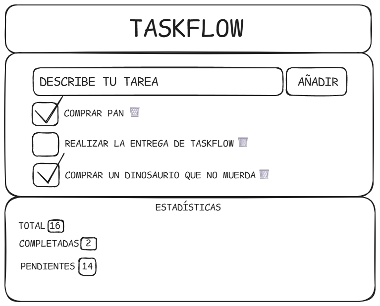

## Demo online

https://bootcamp-project-weld.vercel.app

## Diseño

# TaskFlow

TaskFlow es una aplicación web sencilla para gestionar tareas.  
Permite crear, completar, editar y eliminar tareas, además de filtrarlas y organizarlas mediante tags y programación por fechas.

El objetivo de este proyecto es practicar el desarrollo frontend utilizando **HTML, CSS y JavaScript**, además de trabajar con **Git, GitHub y LocalStorage**.

---

# Diseño

El diseño inicial de la aplicación se realizó previamente antes de comenzar a programar, utilizando un wireframe sencillo para definir la estructura de la interfaz.

El wireframe fue creado con **Excalidraw** y se encuentra guardado dentro del repositorio en:

El diseño incluye las siguientes secciones principales:

- Cabecera con el nombre de la aplicación
- Formulario para añadir nuevas tareas
- Lista de tareas
- Panel de estadísticas
- Sistema de tags para clasificar tareas

---

# Funcionalidades

La aplicación permite realizar las siguientes acciones:

### Gestión de tareas
- Crear nuevas tareas
- Marcar tareas como completadas
- Editar el título de una tarea
- Eliminar tareas individuales
- Confirmación antes de eliminar una tarea

### Organización
- Añadir **tags opcionales** a las tareas
- Ver una lista automática de tags creados
- Filtrar tareas por **estado**
- Filtrar tareas por **tag**
- Buscar tareas por texto

### Programación de tareas
Las tareas pueden programarse con:

- Fecha y hora de inicio
- Fecha y hora de finalización

Según la fecha configurada la aplicación indica si una tarea está:

- Programada
- Próxima
- Vencida
- Completada

### Acciones masivas
- Completar todas las tareas
- Borrar todas las tareas completadas

### Estadísticas
La aplicación muestra en tiempo real:

- Total de tareas
- Tareas completadas
- Tareas pendientes

### Persistencia de datos
Las tareas se guardan automáticamente en **LocalStorage**, por lo que permanecen disponibles aunque se recargue la página.

Documentación oficial de LocalStorage:  
https://developer.mozilla.org/en-US/docs/Web/API/Window/localStorage

### Modo oscuro
La aplicación incluye un **modo oscuro** que puede activarse desde el botón superior.  
La preferencia del usuario se guarda también en LocalStorage.

### Diseño responsive
La interfaz se adapta correctamente a diferentes tamaños de pantalla, incluyendo dispositivos móviles.

---

# Tecnologías utilizadas

Este proyecto se ha desarrollado utilizando:

- **HTML5** para la estructura semántica
- **CSS3** para el diseño y layout responsive
- **JavaScript (Vanilla JS)** para la lógica de la aplicación
- **LocalStorage API** para guardar las tareas
- **Git** para el control de versiones
- **GitHub** para el repositorio del proyecto

---

# Estructura del proyecto

bootcamp-project/
│
├── index.html
├── style.css
├── app.js
├── README.md
│
└── docs/
└── design/
└── taskflow-wireframe.png

---

# Testing manual

Se han realizado las siguientes pruebas manuales para comprobar el funcionamiento de la aplicación.

### Creación de tareas
- Crear una tarea simple
- Crear una tarea con tag
- Crear una tarea con fecha de inicio y fin
- Intentar crear una tarea sin título

### Gestión de tareas
- Marcar tareas como completadas
- Editar una tarea existente
- Eliminar una tarea
- Confirmación antes de eliminar

### Filtros
- Buscar tareas por texto
- Filtrar por estado
- Filtrar por tag

### Acciones masivas
- Completar todas las tareas
- Borrar todas las tareas completadas

### Persistencia
- Recargar la página
- Verificar que las tareas permanecen guardadas

### Responsive
Se probó la aplicación utilizando las herramientas de desarrollo del navegador para simular distintos dispositivos móviles.

---

# Accesibilidad

Se han aplicado algunas prácticas básicas de accesibilidad:

- Uso de etiquetas `label` correctamente asociadas a los inputs
- Navegación posible mediante teclado
- Botones con texto o `aria-label`
- Estados de foco visibles en elementos interactivos

Documentación sobre accesibilidad web:  
https://www.w3.org/WAI/fundamentals/accessibility-intro/

---

# Despliegue

La aplicación será desplegada utilizando **Vercel**, conectando el repositorio de GitHub para realizar despliegues automáticos.

Documentación de Vercel:  
https://vercel.com/docs/deployments/git

Una vez desplegada, la URL pública se añadirá en la parte superior del README.

---
---

# Diseño final
Como diseño final tras la implantación de los TAGS y fechas de programación opcionales, queda el siguiente resultado:

---
# Autor

Proyecto realizado como parte de las prácticas en **Corner Studio**.
